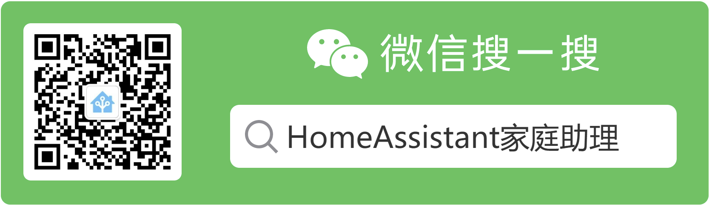

# HomeAssistant学习笔记 👋  

?> 玩转HomeAssistant遇到的各种问题与解决方案

> 联系方式：`QQ: 635147515`，`微信扫下方二维码`，`添加时请注明来意`

> 

#### 关注我的微信订阅号，了解更多HomeAssistant相关知识
 

#### 如果我开发的项目对你有帮助，请我喝杯<del style="font-size: 14px;">咖啡</del>奶茶吧😘
|  |支付宝|微信|
|---|---|---|
奶茶= |   |  
