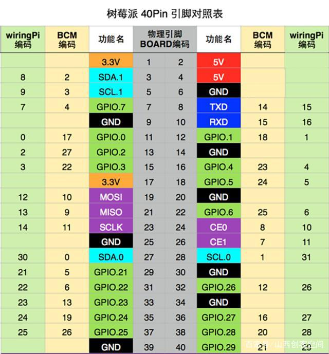

# 树莓派

---

## 修改hostname使用主机名访问
!> 注意：树莓派默认主机名为raspberrypi，多个设备可能冲突
```bash
# 判断是否能ping通
ping homeassistant.local

# 修改主机名称为homeassistant
sudo nano /etc/hostname

# 修改主机指向
# 127.0.1.1                     homeassistant
sudo nano /etc/hosts

# 重启后应该就能ping通了
sudo reboot
```

## 配置Windows远程访问服务

```bash
# 安装xrdp相关服务 
sudo apt-get install tightvncserver xrdp -y
```

> 在windows上按下`WIN键+R`输入`mstsc`，打开远程连接输入树莓派IP用户密码即可

## 创建AP热点

- 视频教程：https://www.bilibili.com/video/BV1it4y1S7Ab/

```bash
# 安装依赖
sudo apt install dnsmasq hostapd -y

# 编译代码
git clone https://github.com/oblique/create_ap
cd create_ap
make install

# 会自动开机启动AP热点
# 查看启动状态
sudo systemctl status create_ap

# 编辑配置
sudo nano /etc/create_ap.conf
```

源码：https://github.com/oblique/create_ap

## 查看外网IP
https://www.ip.cn/api/index?ip=&type=0

## 设置系统音量
```bash
# 图形化设置音量
alsamixer
```
!> 使用命令行控制音量，请注意相关服务的安装
```bash
# 查看声卡
amixer scontrols
# 可能显示如下
# Simple mixer control 'Master',0
# Simple mixer control 'Capture',0

# 调整音量到80%
amixer set Master 80%
```
!> 如果使用了`PulseAudio`服务`amixer`可能会无法控制`PCM`
```bash
# 在使用PulseAudio服务时，可以通过以下命令控制

# 查看Sink序号方法一
pactl list sinks
# 查看Sink序号方法二
pacmd list-sinks

# 设置音量
# pactl set-sink-volume sink序号 音量
pactl set-sink-volume 1 50%
# 通过+-设置相对值
pactl set-sink-volume 1 +5%
```

## 自动挂载USB存储设备
```bash
# 添加USB存储规则
sudo nano /etc/udev/rules.d/10-usbstorage.rules
```
将以下内容写入后，重新插入USB存储设备即可
```txt
KERNEL!="sd*", GOTO="media_by_label_auto_mount_end"
SUBSYSTEM!="block",GOTO="media_by_label_auto_mount_end"
IMPORT{program}="/sbin/blkid -o udev -p %N"
ENV{ID_FS_TYPE}=="", GOTO="media_by_label_auto_mount_end"
ENV{ID_FS_LABEL}!="", ENV{dir_name}="%E{ID_FS_LABEL}"
ENV{ID_FS_LABEL}=="", ENV{dir_name}="Untitled-%k"
ACTION=="add", ENV{mount_options}="relatime,sync"
ACTION=="add", ENV{ID_FS_TYPE}=="vfat", ENV{mount_options}="iocharset=utf8,umask=000"
ACTION=="add", ENV{ID_FS_TYPE}=="ntfs", ENV{mount_options}="iocharset=utf8,umask=000"
ACTION=="add", RUN+="/bin/mkdir -p /media/%E{dir_name}", RUN+="/bin/mount -o $env{mount_options} /dev/%k /media/%E{dir_name}"
ACTION=="remove", ENV{dir_name}!="", RUN+="/bin/umount -l /media/%E{dir_name}", RUN+="/bin/rmdir /media/%E{dir_name}" 
LABEL="media_by_label_auto_mount_end"
```
原文链接：https://blog.csdn.net/u012589578/article/details/77703794

## 相关操作记录

> 挂载分区
```bash
# 挂载到/root目录
mount /dev/mmcblk0p2 /root/
# 查看当前运行的进程
fuser -m -v /dev/mmcblk0p2
``` 

> 备份系统到U盘
```bash
# 挂载目录
mount /dev/sda1 /mnt/
# 备份压缩系统到U盘（即使错误也不停止：conv=noerror）
sudo dd conv=noerror if=/dev/mmcblk0 bs=4M |gzip > /mnt/backup.img

# 查看进度（另开一个终端）
watch -n 5 pkill -USR1 ^dd$

# 还原系统到sd卡，请先仔细仔细仔细的看文档，很重要很重要很重要

```
- https://yanke.info/?id=124

> tar备份系统
```bash
# 详细操作，请看原文链接
sudo su
cd /
# 压缩备份到存储卡里
tar -cvpzf /mnt/backup.tgz --exclude=/proc --exclude=/lost+found --exclude=/mnt --exclude=/sys /

# 还原文件到系统，请先仔细仔细仔细的看文档，很重要很重要很重要
tar -xvpzf /mnt/backup.tgz -C /
```

- https://www.cnblogs.com/lvdongjie/p/3835525.html

## 树莓派GPIO接口 - 40针

<div style="width:200px;height:250px;float:left;margin-right:10px;">
    <h6 style="margin: 15px 0;">树莓派方位示意介绍</h6>
    <div style="background:green;height:100%;">
        <div style="width:25px;height:180px;
                border-left: 5px dashed black;
                    border-right: 5px dashed black;
            float:right;margin:10px;">
        </div>
    </div>
</div>


## 一些命令
```bash
# CPU占用最多的前10个进程
ps auxw|head -1;ps auxw|sort -rn -k3|head -10

# 查看目录下文件目录大小
sudo du -ah --max-depth=1 ./

# 查看文件大小
ls -lh

# 查询端口号占用
lsof -i:1880

# 强制关闭进程
kill -9 PID
```

> 修改ls命令别名
```bash
sudo nano ~/.bashrc

# 删除别名注释
#alias ll='ls -l'
#alias la='ls -A'
#alias l='ls -CF'
```

## 安装DLNA播放器
```bash
cd /usr/share/keyrings/
sudo wget https://www.lesbonscomptes.com/pages/lesbonscomptes.gpg

cd /etc/apt/sources.list.d
sudo wget https://www.lesbonscomptes.com/upmpdcli/pages/upmpdcli-rbuster.list

sudo apt-get update
sudo apt-get install upmpdcli -y

sudo nano /etc/upmpdcli.conf
# avfriendlyname = RaspberryPi

sudo systemctl restart upmpdcli

sudo systemctl status upmpdcli
```


## 连接蓝牙音箱

https://raspberrypi.stackexchange.com/questions/48140/raspberry-pi-3-connecting-to-bluetooth-audio-device-on-raspbian-jessie/116953

```bash
bluetoothctl

power on

agent on

default-agent

scan on

pair D4:60:75:CA:DF:A7

trust D4:60:75:CA:DF:A7

connect D4:60:75:CA:DF:A7

# 移除设备
remove D4:60:75:CA:DF:A7

# 显示设备信息
info D4:60:75:CA:DF:A7 

# 显示设备
devices


# 显示蓝牙音箱
pactl list sinks

pactl set-default-sink bluez_sink.D4_60_75_CA_DF_A7.a2dp_sink
```