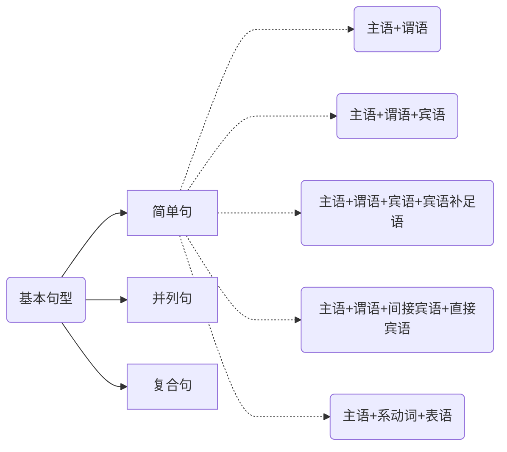
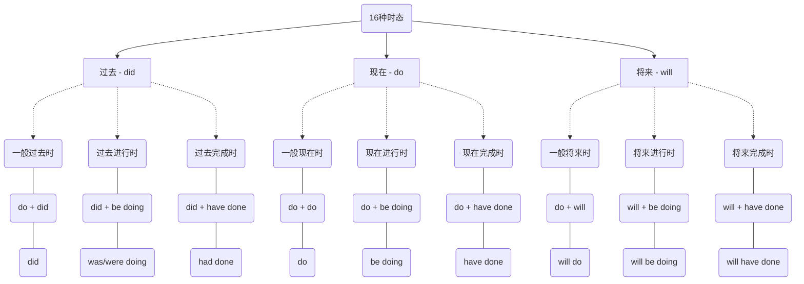
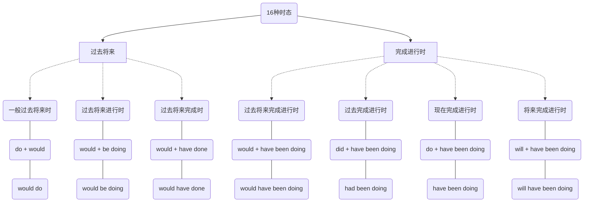
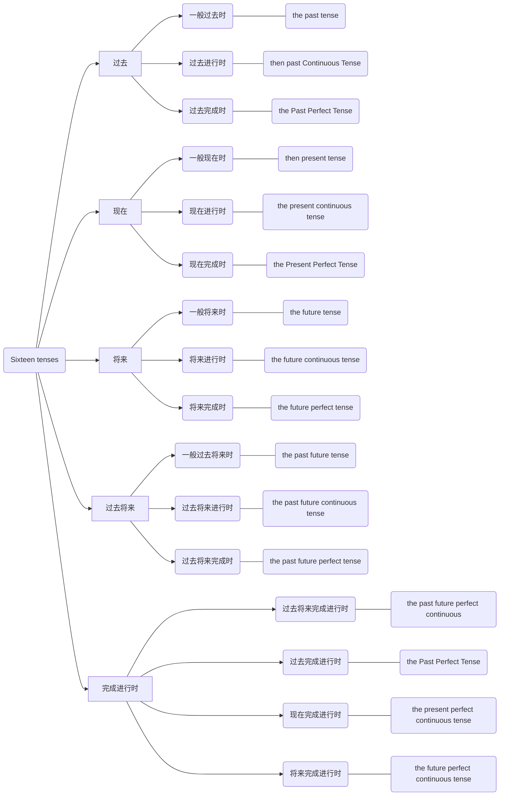
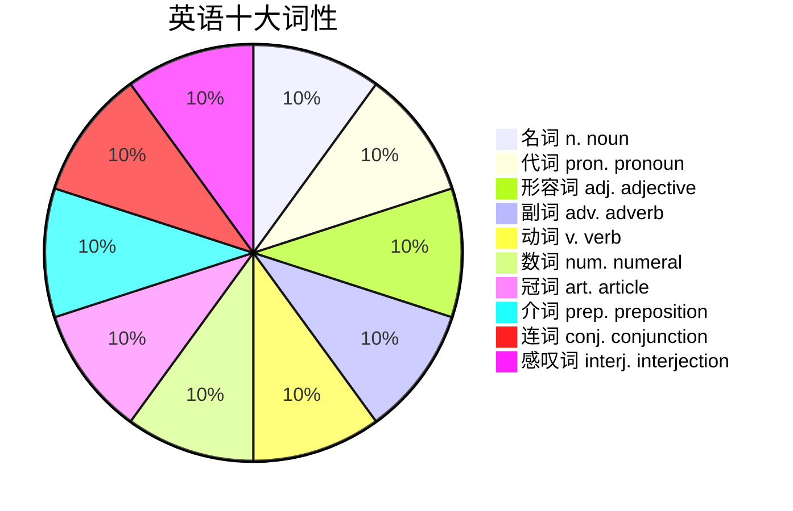
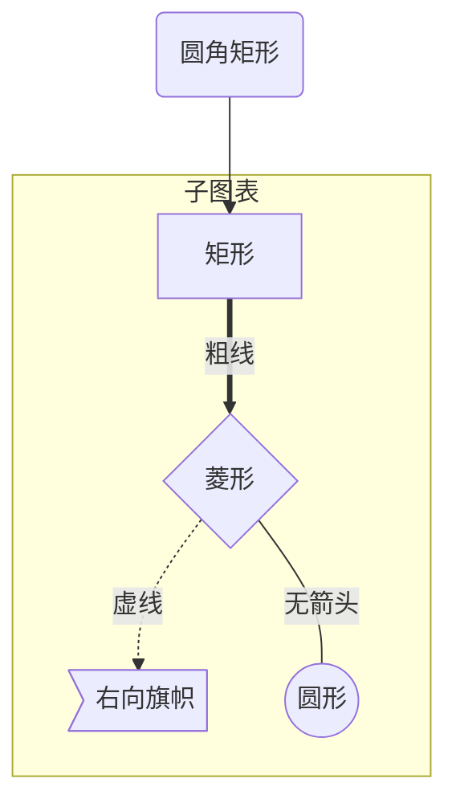

# 从零开始学英语

```mermaid
graph LR
    t1(基本句型)-->t2-1[简单句]
        t2-1-..->3-1(主语+谓语)
        t2-1-..->3-2(主语+谓语+宾语)
        t2-1-..->3-3(主语+谓语+宾语+宾语补足语)
        t2-1-..->3-4(主语+谓语+间接宾语+直接宾语)
        t2-1-..->3-5(主语+系动词+表语)
    t1-->t2-2[并列句]
    t1-->t2-3[复合句]
```
---
### 16种时态 - Sixteen tenses

```mermaid
graph TB
    one(16种时态)-->two-one[过去 - did]
        two-one-..->three-one(一般过去时)
          ---four-one(do + did)
          ---four-two(did)
        two-one-..->three-two(过去进行时)
          ---four-two-one(did + be doing)
          ---four-two-two(was/were doing)          
        two-one-..->three-three(过去完成时)
          ---four-two-three(did + have done)
          ---four-two-four(had done)
    one-->two-two[现在 - do]
        two-two-..->three-two-one(一般现在时)
          ---four-three-one(do + do)
          ---four-three-two(do)
        two-two-..->three-two-two(现在进行时)
          ---four-four-one(do + be doing)
          ---four-four-two(be doing)
        two-two-..->three-two-three(现在完成时)
          ---four-five-one(do + have done)
          ---four-five-two(have done)
    one-->two-three[将来 - will]
        two-three-..->three-three-one(一般将来时)
          ---four-six-one(do + will)
          ---four-six-two(will do)
        two-three-..->three-three-two(将来进行时)
          ---four-seven-one(will + be doing)
          ---four-seven-two(will be doing)
        two-three-..->three-three-three(将来完成时)
          ---four-eight-one(will + have done)
          ---four-eight-two(will have done)
```

```mermaid
graph TB
    one(16种时态)-->two-four[过去将来]
        two-four-..->three-four-one(一般过去将来时)
          ---four-nine-one(do + would)
          ---four-nine-two(would do)
        two-four-..->three-four-two(过去将来进行时)
          ---four-ten-one(would + be doing)
          ---four-ten-two(would be doing)
        two-four-..->three-four-three(过去将来完成时)
          ---four-eleven-one(would + have done)
          ---four-eleven-two(would have done)
    one-->two-five[完成进行时]
        two-five-..->three-five-one(过去将来完成进行时)
          ---four-twelve-one(would + have been doing)
          ---four-twelve-two(would have been doing)
        two-five-..->three-five-two(过去完成进行时)
          ---four-thirteen-one(did + have been doing)
          ---four-thirteen-two(had been doing)
        two-five-..->three-five-three(现在完成进行时)
          ---four-fourteen-one(do + have been doing)
          ---four-fourteen-two(have been doing)
        two-five-..->three-five-four(将来完成进行时)
          ---four-fifteen-one(will + have been doing)
          ---four-fifteen-two(will have been doing)
```

```mermaid
graph LR
    one(Sixteen tenses)-->two-one[过去]
      two-one-->three-one-one(一般过去时)
        ---four-one-one(the past tense)
      two-one-->three-one-two(过去进行时)
        ---four-one-two(then past Continuous Tense)
      two-one-->three-one-three(过去完成时)
        ---four-one-three(the Past Perfect Tense)
    one-->two-two[现在]
      two-two-->three-two-one(一般现在时)
        ---four-two-one(then present tense)
      two-two-->three-two-two(现在进行时)
        ---four-two-two(the present continuous tense)
      two-two-->three-two-three(现在完成时)
        ---four-two-three(the Present Perfect Tense)
    one-->two-three[将来]
      two-three-->three-three-one(一般将来时)
        ---four-three-one(the future tense)
      two-three-->three-three-two(将来进行时)
        ---four-three-two(the future continuous tense)
      two-three-->three-three-three(将来完成时)
        ---four-three-three(the future perfect tense)
    one-->two-four[过去将来]
      two-four-->three-four-one(一般过去将来时)
        ---four-four-one(the past future tense)
      two-four-->three-four-two(过去将来进行时)
        ---four-four-two(the past future continuous tense)
      two-four-->three-four-three(过去将来完成时)
        ---four-four-three(the past future perfect tense)
    one-->two-five[完成进行时]
      two-five--->three-five-one(过去将来完成进行时)
        ---four-five-one(the past future perfect continuous)
      two-five--->three-five-two(过去完成进行时)
        ---four-five-two(the Past Perfect Tense)
      two-five--->three-five-three(现在完成进行时)
        ---four-five-three(the present perfect continuous tense)
      two-five--->three-five-four(将来完成进行时)
        ---four-five-four(the future perfect continuous tense)
```

```mermaid
pie
    title 英语十大词性
    "名词 n. noun " : 1
    "代词 pron. pronoun " : 1
    "形容词 adj. adjective " : 1
    "副词 adv. adverb " : 1
    "动词 v. verb " : 1
    "数词 num. numeral " : 1
    "冠词 art. article " : 1
    "介词 prep. preposition " : 1
    "连词 conj. conjunction " : 1
    "感叹词 interj. interjection " : 1
```

```mermaid
graph TB
    id1(圆角矩形)-->id2[矩形]
    subgraph 子图表
        id2==粗线==>id3{菱形}
        id3-.虚线.->id4>右向旗帜]
        id3--无箭头---id5((圆形))
    end
```

```mermaid
graph
    默认方形
    id1[方形]
    id2(圆边矩形)
    id3([体育场形])
    id4[[子程序形]]
    id5[(圆柱形)]
    id6((圆形))
```
