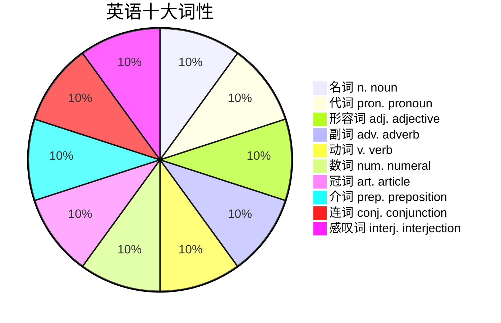

# 十大词性

```mermaid
pie
    title 英语十大词性
    "名词 n. noun " : 1
    "代词 pron. pronoun " : 1
    "形容词 adj. adjective " : 1
    "副词 adv. adverb " : 1
    "动词 v. verb " : 1
    "数词 num. numeral " : 1
    "冠词 art. article " : 1
    "介词 prep. preposition " : 1
    "连词 conj. conjunction " : 1
    "感叹词 interj. interjection " : 1
```
