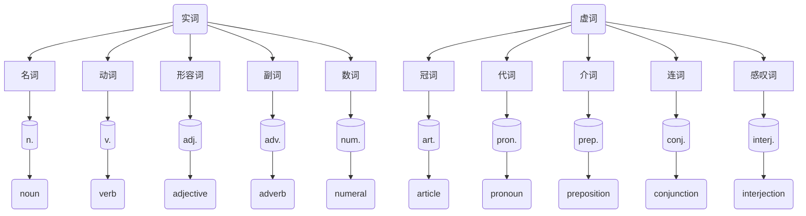
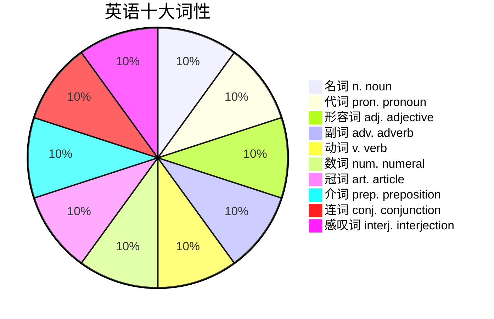

# 词性

词性，英文翻译成`Word Classes`，或`Parts of Speech`，故名思议，词性就是根据单词再句子中的不同作用来区别划分的

```mermaid
graph
  root-one(实词)
    root-one-->one[名词] --> 1-1[(n.)]--> one-one(noun)
    root-one-->two[动词] --> 1-2[(v.)] --> two-one(verb)
    root-one-->three[形容词] --> 1-3[(adj.)] --> three-one(adjective)
    root-one-->four[副词] --> 1-4[(adv.)] --> four-one(adverb)
    root-one-->five[数词] --> 1-5[(num.)] --> five-one(numeral)
  root-two(虚词)
    root-two-->six[冠词] --> 1-6[(art.)] --> six-one(article)
    root-two-->seven[代词] --> 1-7[(pron.)] --> seven-one(pronoun)
    root-two-->eight[介词] --> 1-8[(prep.)] --> eight-one(preposition)
    root-two-->nine[连词] --> 1-9[(conj.)] --> nine-one(conjunction)
    root-two-->ten[感叹词] --> 1-10[(interj.)] --> ten-one(interjection)
```

```mermaid
pie
    title 英语十大词性
    "名词 n. noun " : 1
    "代词 pron. pronoun " : 1
    "形容词 adj. adjective " : 1
    "副词 adv. adverb " : 1
    "动词 v. verb " : 1
    "数词 num. numeral " : 1
    "冠词 art. article " : 1
    "介词 prep. preposition " : 1
    "连词 conj. conjunction " : 1
    "感叹词 interj. interjection " : 1
```
