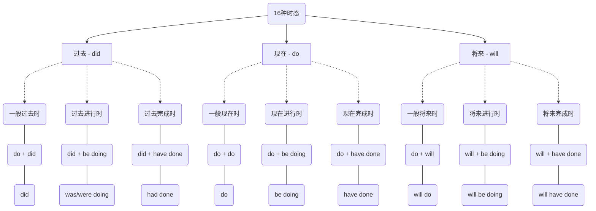
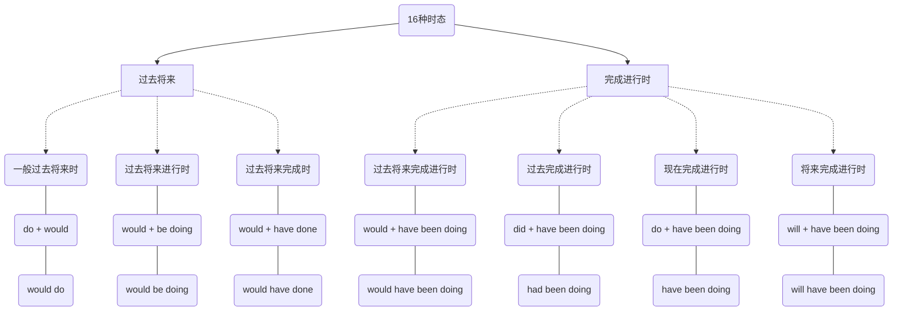
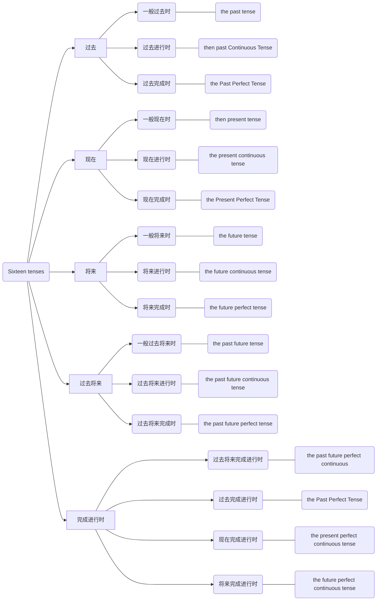

# 16种时态 - Sixteen tenses

### 一般过去时
### 一般现在时
### 一般将来时
### 过去进行时
### 现在进行时
### 将来进行时
### 过去完成时
### 现在完成时
### 将来完成时
### 一般过去将来时
### 过去将来进行时
### 过去将来完成时
### 过去将来完成进行时
### 过去完成进行时
### 现在完成进行时
### 将来完成进行时