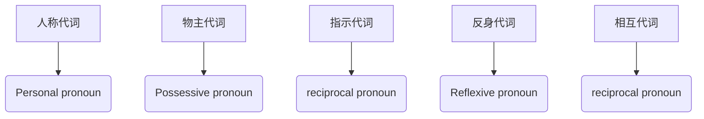
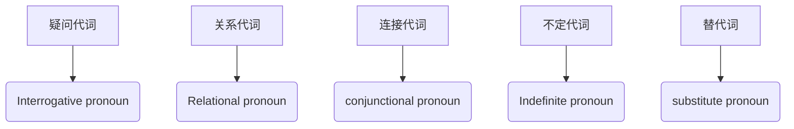
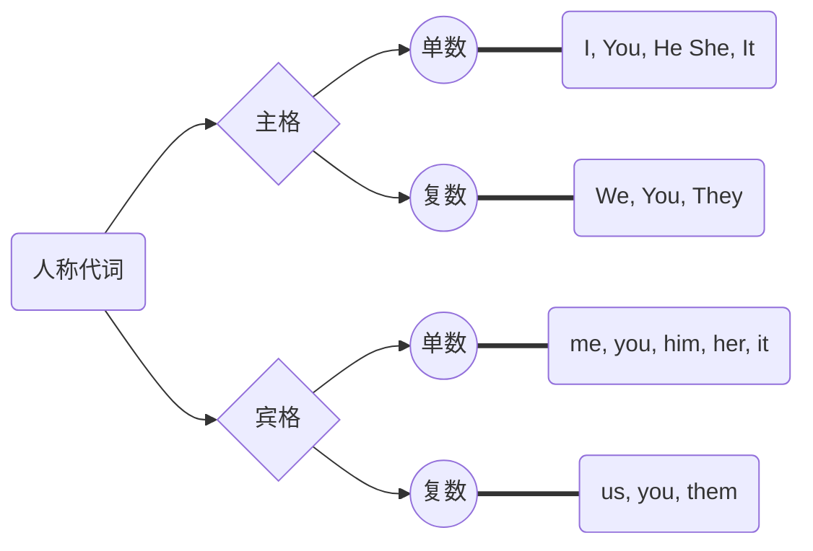

# 代词

代词（英文pronoun，简称pron.），是指代名词或一句话的一种词类。大多数代词具有名词和形容词的功能

---

```mermaid
graph
    one[人称代词] --> one-one(Personal pronoun)
    two[物主代词] --> two-one(Possessive  pronoun)
    three[指示代词] --> three-one(reciprocal pronoun)
    four[反身代词] --> four-one(Reflexive pronoun)
    five[相互代词] --> five-one(reciprocal pronoun)
```
---

```mermaid
graph
    six[疑问代词] --> six-one(Interrogative pronoun)
    seven[关系代词] --> seven-one(Relational pronoun)
    eight[连接代词] --> eight-one(conjunctional pronoun)
    nine[不定代词] --> nine-one(Indefinite pronoun)
    ten[替代词] --> ten-one(substitute pronoun)
```
---

### 人称代词

```mermaid
graph LR
    root(人称代词)-->nominative{主格}
      nominative-->nominative-singular((单数))===first(I, You, He She, It)
      nominative-->nominative-complex((复数))===second(We, You, They)
    root-->accusative{宾格}
      accusative-->accusative-singular((单数))===third(me, you, him, her, it)
      accusative-->accusative-complex((复数))===fourth(us, you, them)
```
---
### 物主代词

```mermaid
graph LR
    root[物主代词]--某人的...,后加人或物-->nominative{形容词性}
      nominative==>nominative-singular((单数))-..-first>my, your, his, her, Its]
      nominative==>nominative-complex((复数))-..-second>our, your, their]
    root--某人的,单独使用-->accusative{名词性}
      accusative==>accusative-singular((单数))-..-third>mine, yours, his, her, its]
      accusative==>accusative-complex((复数))-..-fourth>ours, yours, theirs]
```
---
### 反身代词

xxx