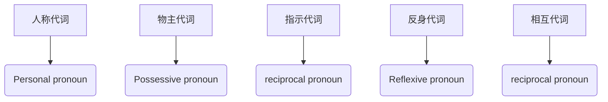
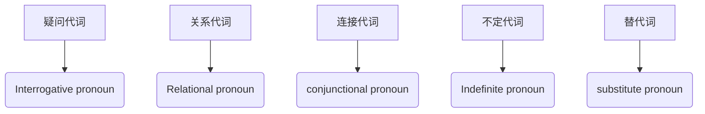
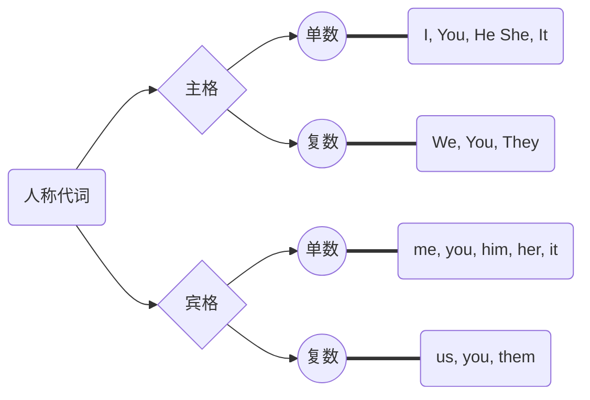
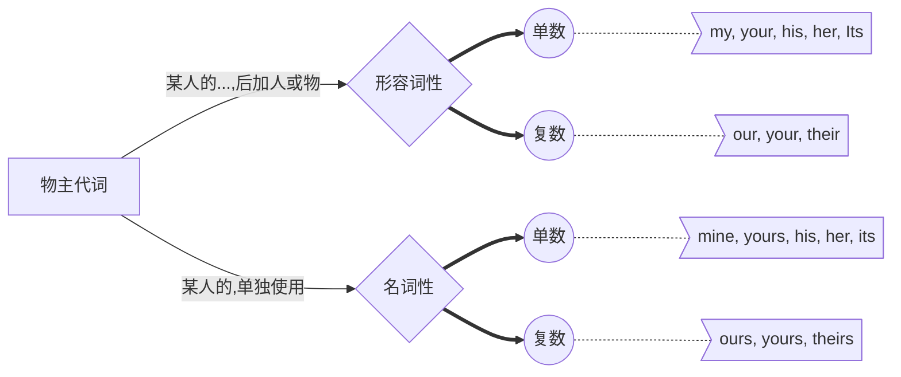
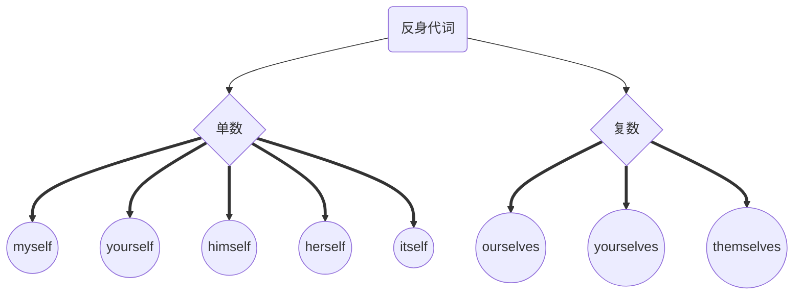
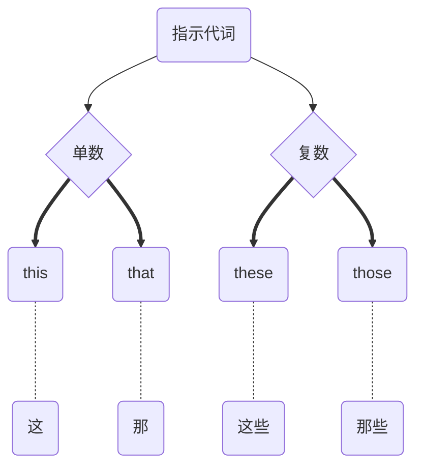
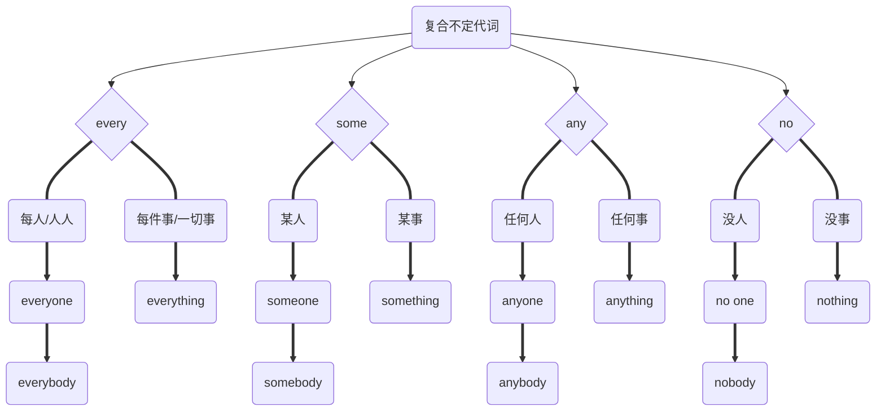

# 代词

代词（英文pronoun，简称pron.），是指代名词或一句话的一种词类。大多数代词具有名词和形容词的功能

---

---

---

### 人称代词

---
### 物主代词

---
### 反身代词

### 指示代词

### 相互代词

`each other` 两者之间 

`one another` 三者之间/三者以上之间

### 疑问代词

### 关系代词

### 连接代词

### 不定代词

`many` 许多，很多 
*代替/修饰可数名词的复数*
 
`much` 很多
*代替/修饰不可数名词的复数*

`a few`（肯定意义）一些
 
`few`（否定意义）几乎没有
*后接可数名词*

`a little`  （肯定意义）一些
 
`little`  （否定意义）几乎没有
*后接不可数名词*

`some` 一些
 
`any` 任何

`each` 每（2个/2个以上）
*后接单数*
 
`every` 每（3个/3个以上）

`either` 
两者中的每一个（谓语用单数）
 
`neither`
两者中的每一个都不（谓语用单数）

都；全部（它们做主语时，谓语动词都要用复数形式）
 
`both` 两者
 
`all` 两者及以上

`other` 另外的；其它的（+名词）
 
`the other` 特指两者中的另一个
 
`another` 泛指3个及以上另一个

### 复合不定代词

### 替代词